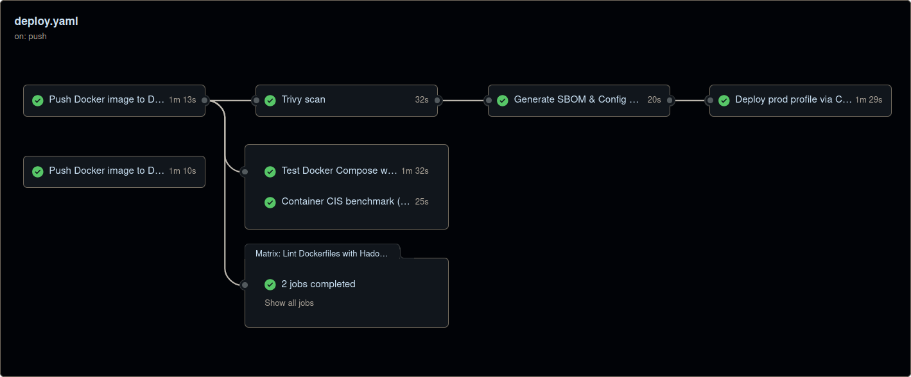

# Проектная работа дисциплины «Docker-контейнеризация и хранение данных»


Микросервисное приложение онлайн-магазина пельменей с полной контейнеризацией, проверками безопасности и CI/CD-конвейером на GitHub Actions.

## Системные требования

| ПО / Ресурс       | Минимальная версия | Описание                        |
|-------------------|--------------------|---------------------------------|
| **Ubuntu Linux**  | 20.04 LTS          | Базовая ОС для `Docker`         |
| **Docker Engine** | 20.10+             | Поддержка `docker compose v2`   |
| **Git**           | любая              | Клонирование репозитория        |
| **RAM**           | ≥ 2 ГБ             | Сборка Go + Node.js образов     |
| **Диск**          | ≥ 5 ГБ             | Образы `Docker` и `build cache` |

## Быстрый старт

### 1. Клонирование репозитория

```bash
git clone https://github.com/DmitryFedoroff/cloud-services-engineer-docker-project-sem2.git
cd cloud-services-engineer-docker-project-sem2
```

### 2. Настройка окружения (опционально)

```bash
# Создать .env файл для уровня логирования
echo "LOG_LEVEL=info" > .env
```

> **Важно:** `NPM_TOKEN` требуется только для приватных `npm-пакетов`. В данном проекте используется как `build argument`, что считается хорошей практикой для `build-time` секретов.

### 3. Запуск приложения

| Режим              | Команда                                                 | Компоненты                  |
|--------------------|---------------------------------------------------------|-----------------------------|
| **Базовый**        | `docker compose up --build -d`                          | backend + frontend          |
| **Dev**            | `docker compose --profile dev up --build -d`            | backend + frontend + lb     |
| **Prod**           | `docker compose --profile prod up --build -d`           | backend + frontend + lb     |
| **Prod + scale**   | `docker compose --profile prod up -d --scale backend=3` | масштабирование backend (Балансировщик нагрузки автоматически распределит нагрузку) |

## Масштабирование

При использовании команды `docker compose --profile prod up -d --scale backend=N`:
- Создаются `N` экземпляров backend-сервиса
- Балансировщик нагрузки (nginx) автоматически распределяет нагрузку между ними
- Используется алгоритм `least_conn` для оптимального распределения запросов
- Каждый экземпляр имеет собственные ограничения ресурсов (1 CPU, 512 MB RAM)

## Архитектура проекта

### Структура каталогов

```
.
├── backend/                        # Go-приложение (Chi-роутер, метрики)
│   ├── Dockerfile                  # Многоэтапная сборка, Alpine Linux
│   ├── .dockerignore               # Исключения для контекста сборки
│   ├── go.mod                      # Зависимости Go-модуля
│   ├── go.sum                      # Контрольные суммы зависимостей
│   ├── cmd/
│   │   └── api/                    # Точка входа приложения
│   │       ├── main.go             # Главный файл, запуск HTTP-сервера на :8081
│   │       ├── router.go           # Конфигурация маршрутов и middleware
│   │       ├── app/                # Бизнес-логика приложения
│   │       │   ├── controller_*.go # HTTP-контроллеры (товары, заказы, категории)
│   │       │   ├── middleware.go   # Промежуточное ПО (метрики, логирование)
│   │       │   └── app.go          # Инициализация приложения
│   │       └── dependencies/       # Внедрение зависимостей
│   └── internal/
│       ├── logger/                 # Конфигурация логирования
│       └── store/dumplings/        # Слой хранения данных
│           ├── models.go           # Модели данных
│           ├── store.go            # Интерфейс хранилища
│           └── fake/               # Реализация in-memory хранилища
├── frontend/                       # Vue.js одностраничное приложение
│   ├── Dockerfile                  # Многоэтапная сборка, Nginx
│   ├── .dockerignore               # Исключения для контекста сборки
│   ├── nginx.conf                  # Конфигурация веб-сервера и обратного прокси
│   ├── package.json                # Зависимости Node.js
│   ├── package-lock.json           # Фиксированные версии зависимостей
│   ├── vue.config.js               # Конфигурация Vue CLI
│   ├── babel.config.js             # Настройки JavaScript
│   ├── public/
│   │   └── index.html              # Главная HTML-страница
│   └── src/                        # Исходный код приложения
│       └── assets/                 # Статические ресурсы
├── docker-compose.yml              # Оркестрация контейнеров (профили: dev, prod)
├── nginx-lb.conf                   # Конфигурация балансировщика нагрузки (least_conn)
├── .gitignore                      # Исключения Git
├── .gitattributes                  # Атрибуты файлов Git
└── .github/
    └── workflows/
        └── deploy.yaml             # CI/CD конвейер GitHub Actions
```

### Сетевая архитектура

| Сеть         | Тип              | Назначение                    |
|--------------|------------------|-------------------------------|
| `public-net` | bridge           | Внешний доступ                |
| `inner-net`  | bridge, internal | Изолированная внутренняя сеть |

### Volumes

| Volume          | Назначение              | Права доступа |
|-----------------|-------------------------|---------------|
| `backend-data`  | Данные приложения       | rw            |
| `backend-logs`  | Логи backend            | rw            |
| `frontend-logs` | Логи frontend           | rw            |
| `lb-logs`       | Логи балансировщика     | rw            |

## Endpoints и API

### Основные точки доступа

| Сервис                     | URL                            | Описание                 |
|----------------------------|--------------------------------|--------------------------|
| **Frontend**               | `http://localhost/momo-store/` | Веб-интерфейс магазина   |
| **Backend API**            | `http://localhost:8081`        | API сервер               |
| **Балансировщик нагрузки** | `http://localhost:8080`        | Балансировщик (dev/prod) |

### Health Check интервалы

| Сервис                     | Интервал | Таймаут | Период запуска |
|----------------------------|----------|---------|----------------|
| **Backend**                | 20s      | 5s      | 10s            |
| **Frontend**               | 30s      | 5s      | 40s            |
| **Балансировщик нагрузки** | 30s      | 5s      | 20s            |

## Безопасность

### Реализованные меры

| Мера                       | Реализация                                           |
|----------------------------|------------------------------------------------------|
| **Non-root пользователи**  | Backend: UID 10001, Frontend/LB: UID 101             |
| **Read-only FS**           | `read_only: true` + `tmpfs` для временных директорий |
| **Capabilities**           | `cap_drop: ALL`, `cap_add: NET_BIND_SERVICE` (nginx) |
| **Security options**       | `no-new-privileges: true` для всех контейнеров       |
| **Resource limits**        | Backend: 1 CPU/512MB, LB: 0.5 CPU/128MB              |
| **Сетевая изоляция**       | Разделение на public и internal сети                 |

## Управление секретами

### Использование NPM_TOKEN

#### Вариант 1: Переменная окружения (рекомендуется)

```bash
export NPM_TOKEN="your-actual-npm-token"
docker compose --profile dev up --build -d
```

#### Вариант 2: Inline передача

```bash
NPM_TOKEN="your-actual-npm-token" docker compose --profile dev up --build -d
```

#### Вариант 3: Docker Secrets (опционально, требует Swarm)

> **Примечание:** `Docker Secrets` работают только в режиме `Swarm`. Для данного проекта это избыточно, так как `NPM_TOKEN` используется как `build argument`.

1. **Проверка статуса Docker Swarm:**

```bash
docker info --format '{{ .Swarm.LocalNodeState }}'
# Вывод "active" - Swarm активен
# Вывод "inactive" - Swarm не инициализирован
```

2. **Инициализация Swarm (если inactive):**

```bash
sudo docker swarm init --advertise-addr 127.0.0.1
```

3. **Создание секрета с вашим токеном NPM:**

```bash
# ВАЖНО: Используйте ваш реальный NPM токен, НЕ Swarm токен!
echo "your-actual-npm-token" | docker secret create npm_token -

# Проверка
docker secret ls
```

4. **Удаление секрета и выход из Swarm (при необходимости):**

```bash
docker secret rm npm_token
docker swarm leave --force
```

## CI/CD Pipeline

### GitHub Actions Workflow

| Этап                  | Инструменты                      | Описание                               |
|-----------------------|----------------------------------|----------------------------------------|
| **Build & Push**      | Docker Buildx --> DockerHub      | Сборка и публикация образов            |
| **Trivy Scan**        | Aquasecurity Trivy               | Сканирование CRITICAL/HIGH уязвимостей |
| **SBOM Generation**   | Syft                             | Генерация Software Bill of Materials   |
| **Config Scan**       | Trivy IaC                        | Проверка конфигураций                  |
| **Hadolint**          | Hadolint                         | Линтинг Dockerfile                     |
| **Dockle**            | Goodwithtech Dockle              | CIS Benchmark проверки                 |
| **Integration Tests** | Docker Compose                   | Тестирование всего стека               |

<details>
<summary><b>Скриншот: Полный цикл CI/CD - сборка образов, проверка безопасности, развёртывание и тестирование</b></summary>



</details>

## Мониторинг и логирование

### Просмотр логов

```bash
# Все сервисы
docker compose logs -f

# Конкретный сервис
docker compose logs -f backend
docker compose logs -f frontend
docker compose logs -f loadbalancer
```

### Здоровье

```bash
curl http://localhost:8081/health       # Backend
curl http://localhost/momo-store/       # Frontend
curl http://localhost:8080/health       # Балансировщик нагрузки (dev/prod)
```

### Статистика ресурсов

```bash
# Использование ресурсов
docker stats --no-stream

# Статус контейнеров
docker compose ps
```

## Устранение неполадок

| Проблема                     | Диагностика                        | Решение                              |
|------------------------------|------------------------------------|--------------------------------------|
| Порт занят                   | `sudo lsof -i :80`                 | Остановить конфликтующий процесс     |
| NPM 403 Forbidden            | Проверить логи frontend            | Проверить корректность NPM_TOKEN     |
| Контейнер unhealthy          | `docker compose logs service_name` | Проверить конфигурацию и зависимости |
| Volumes не создаются         | `docker volume ls`                 | Проверить права доступа              |
| Docker daemon не запущен     | `sudo systemctl status docker`     | `sudo systemctl start docker`        |

## Очистка системы

```bash
# Остановка и удаление контейнеров с volumes
docker compose down -v

# Удаление конкретного профиля
docker compose --profile prod down -v

# Полная очистка Docker системы
docker system prune -a --volumes
```

## Контакты

- **Автор**: Дмитрий Федоров
- **Эл. почта**: [fedoroffx@gmail.com](mailto:fedoroffx@gmail.com)
- **Telegram**: [https://t.me/dmitryfedoroff](https://t.me/dmitryfedoroff)
